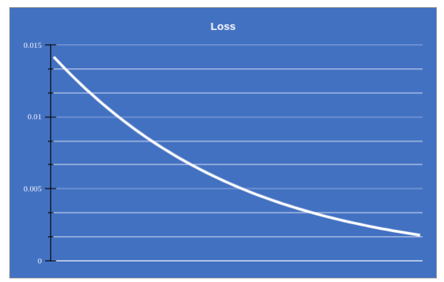

# Part 1 - Back Propogation

## Description

The image of the Excel sheet with back propogation formulae for the given simple NN is as shown below followed by the description of the major steps and the associated formulae.


The major steps of backpropagation are :

### 1. Forward Propagation:

#### Start with the input layer, where you have two input nodes, i1 and i2.

#### Calculate the values of the hidden layer nodes, h1 and h2, using the weighted sum of the inputs and the corresponding weights:

        h1 = w1i1 + w2i2
        h2 = w3i1 + w4i2
#### Apply the activation function σ (sigmoid function) to the hidden layer nodes to obtain their activation values:

        a_h1 = σ(h1) = 1 / (1 + exp(-h1))
        a_h2 = σ(h2)
#### Calculate the values of the output layer nodes, o1 and o2, using the weighted sum of the activation values from the hidden layer and the corresponding weights:

        o1 = w5a_h1 + w6a_h2
        o2 = w7a_h1 + w8a_h2

#### Apply the activation function σ to the output layer nodes to obtain their activation values:

        a_o1 = σ(o1)
        a_o2 = σ(o2)

### 2. Error Calculation:

#### Calculate the total error, E_total, which is the sum of individual errors, E1 and E2:
        E1 = ½ * (t1 - a_o1)²
        E2 = ½ * (t2 - a_o2)²
        E_total = E1 + E2


### 3. Backward Propagation:

#### Calculating ∂E_total/∂w5. Here's a step-by-step breakdown of the calculation:

        Partial derivative of the total error with respect to w5:

                ∂E_total/∂w5 = ∂E1/∂w5
        Since E_total = E1 + E2, we only consider the derivative of E1 with respect to w5.

        Partial derivative of E1 with respect to a_o1:

                ∂E1/∂a_o1 = (a_o1 - t1)
        This is derived from the expression E1 = ½ * (t1 - a_o1)².

        Partial derivative of a_o1 with respect to o1:

                ∂a_o1/∂o1 = a_o1 * (1 - a_o1)
        This is obtained from the derivative of the sigmoid function σ(o1).
        Partial derivative of o1 with respect to w5:

                ∂o1/∂w5 = a_h1
        The weight w5 is directly multiplied by the activation value a_h1 in the expression for         o1. By combining these partial derivatives, we can calculate ∂E_total/∂w5 as follows:

        ∂E_total/∂w5 = ∂E1/∂w5 = ∂E1/∂a_o1 * ∂a_o1/∂o1 * ∂o1/∂w5
                = (a_o1 - t1) * a_o1 * (1 - a_o1) * a_h1

       This expression represents the partial derivative of the total error with respect to the        weight w5 in the neural network. The other partial derivatives you provided follow a            similar calculation pattern for their respective weights.
       
       The partial derivatives of the total error with respect to the other respective weights:

                ∂E_total/∂w5 = (a_o1 - t1) * a_o1 * (1 - a_o1) * a_h1
                ∂E_total/∂w6 = (a_o1 - t1) * a_o1 * (1 - a_o1) * a_h2
                ∂E_total/∂w7 = (a_o2 - t2) * a_o2 * (1 - a_o2) * a_h1
                ∂E_total/∂w8 = (a_o2 - t2) * a_o2 * (1 - a_o2) * a_h2
       These formulae represent the gradients of the total error with respect to the respective        weights. They are used during the weight update step in backpropagation to adjust the            weights of the neural network in the direction that minimizes the error.

#### Compute the gradients of the error with respect to the output layer activations:

        δE_total/δa_o1 = (a_o1 - t1)
        δE_total/δa_o2 = (a_o2 - t2)

#### Calculate the gradients of the output layer activations with respect to their weighted sums:

        δa_o1/δo1 = σ'(o1) = σ(o1) * (1 - σ(o1))
        δa_o2/δo2 = σ'(o2) = σ(o2) * (1 - σ(o2))

#### Compute the gradients of the error with respect to the output layer weighted sums:

        δE_total/δo1 = δE_total/δa_o1 * δa_o1/δo1
        δE_total/δo2 = δE_total/δa_o2 * δa_o2/δo2

#### Calculate the gradients of the hidden layer activations with respect to their weighted sums:

        δa_h1/δh1 = σ'(h1) = σ(h1) * (1 - σ(h1))
        δa_h2/δh2 = σ'(h2) = σ(h2) * (1 - σ(h2))

#### Compute the gradients of the error with respect to the Hidden layer activations
The following expressions represent the gradients of the total error with respect to the activations of the hidden layer nodes. They are used in backpropagation to propagate the error from the output layer to the hidden layer, allowing for weight updates in the hidden layer as well.

        ∂E1/∂a_h1 = (a_o1 - t1) * a_o1 * (1 - a_o1) * w5

        ∂E2/∂a_h1 = (a_o2 - t2) * a_o2 * (1 - a_o2) * w7

        ∂E_total/∂a_h1 = (a_o1 - t1) * a_o1 * (1 - a_o1) * w5 + (a_o2 - t2) * a_o2 * (1 - a_o2) * w7

        ∂E1/∂a_h2 = (a_o1 - t1) * a_o1 * (1 - a_o1) * w6

        ∂E2/∂a_h2 = (a_o2 - t2) * a_o2 * (1 - a_o2) * w8

        ∂E_total/∂a_h2 = (a_o1 - t1) * a_o1 * (1 - a_o1) * w6 + (a_o2 - t2) * a_o2 * (1 - a_o2) * w8

#### Compute the gradients of the error with respect to the hidden layer weighted sums:

        δE_total/δh1 = (δE_total/δo1 * w5 + δE_total/δo2 * w7) * δa_h1/δh1
        δE_total/δh2 = (δE_total/δo1 * w6 + δE_total/δo2 * w8) * δa_h2/δh2

#### Compute the total error with respect to the weights connecting input-hidden layers
        The following formulae are used to calculate the partial derivatives of the total error with respect to the weights connecting the input layer to the hidden layer:

        ∂E_total/∂w1 = ∂E_total/∂a_h1 * ∂a_h1/∂h1 * ∂h1/∂w1
        ∂E_total/∂w2 = ∂E_total/∂a_h1 * ∂a_h1/∂h1 * ∂h1/∂w2
        ∂E_total/∂w3 = ∂E_total/∂a_h2 * ∂a_h2/∂h2 * ∂h2/∂w3
        These formulae involve the chain rule, allowing the gradients to be propagated from the output layer through the hidden layer to the input layer. By calculating these partial                  derivatives, you can determine the adjustments needed for the weights connecting the input layer to the hidden layer during the weight update step in backpropagation.
        

        The partial derivatives of the total error with respect to the weights connecting the input layer to the hidden layer:

        ∂E_total/∂w1 = ((a_o1 - t1) * a_o1 * (1 - a_o1) * w5 + (a_o2 - t2) * a_o2 * (1 - a_o2) * w7) * a_h1 * (1 - a_h1) * i1
        ∂E_total/∂w2 = ((a_o1 - t1) * a_o1 * (1 - a_o1) * w5 + (a_o2 - t2) * a_o2 * (1 - a_o2) * w7) * a_h1 * (1 - a_h1) * i2
        ∂E_total/∂w3 = ((a_o1 - t1) * a_o1 * (1 - a_o1) * w6 + (a_o2 - t2) * a_o2 * (1 - a_o2) * w8) * a_h2 * (1 - a_h2) * i1
        ∂E_total/∂w4 = ((a_o1 - t1) * a_o1 * (1 - a_o1) * w6 + (a_o2 - t2) * a_o2 * (1 - a_o2) * w8) * a_h2 * (1 - a_h2) * i2
        
       These equations represent the gradients of the total error with respect to the weights connecting the input layer to the hidden layer. They take into account the contributions of the          output layer errors, the activations of the hidden layer nodes, and the inputs from the input layer. These partial derivatives are used to update the weights during the backpropagation        process.

### 4. Weight Update:

#### Update the weights connecting the hidden layer to the output layer:

        Δw5 = -η * δE_total/δo1 * a_h1
        Δw6 = -η * δE_total/δo1 * a_h2
        Δw7 = -η * δE_total/δo2 * a_h1
        Δw8 = -η * δE_total/δo2 * a_h2

#### Update the weights connecting the input layer to the hidden layer:

        Δw1 = -η * δE_total/δh1 * i1
        Δw2 = -η * δE_total/δh1 * i2
        Δw3 = -η * δE_total/δh2 * i1
        Δw4 = -η * δE_total/δh2 * i2

#### Update the weights using the learning rate (η) and the calculated weight changes:

        w1 = w1 + Δw1
        w2 = w2 + Δw2
        w3 = w3 + Δw3
        w4 = w4 + Δw4
        w5 = w5 + Δw5
        w6 = w6 + Δw6
        w7 = w7 + Δw7
        w8 = w8 + Δw8
These steps represent the basic procedure of backpropagation in a neural network. The calculations involve forward propagation to obtain output values, error calculation, and then backpropagation to update the weights based on the gradients of the error. 'η' is the learning rate


## Error / Loss Graphs

### Error Graph for Learning Rate - 0.1


### Error Graph for Learning Rate - 0.2

 


### Error Graph for Learning Rate - 0.5

 


### Error Graph for Learning Rate - 0.8


### Error Graph for Learning Rate - 1.0


### Error Graph for Learning Rate - 2.0

 


# Part 2 - Neural Network Image Classification - MNIST Data Set

## Description

This project includes two Python files: `model.py`, and `S5.ipynb`. These files are part of a machine learning project for image classification using the MNIST dataset. The project is about training a neural network model to recognize handwritten digits.

Few samples in the dataset are shown below. [Image taken from S5 assignment]


## Files

### 1. model.py

This file defines the structure of the neural network model used for image classification. The `Net` class is a subclass of `torch.nn.Module` and consists of several convolutional and fully connected layers. The `forward` method implements the forward pass of the model, and the `summary` method provides a summary of the model's architecture. The network architecture uses batch normalization as part of regularization and uses dropout of 0.30 so that the model gives an improved test accuracy. As we find from the model summary, the total number of parameters this model uses is around 17.5K. 

```
----------------------------------------------------------------
        Layer (type)               Output Shape         Param #
================================================================
            Conv2d-1           [-1, 16, 28, 28]             160
              ReLU-2           [-1, 16, 28, 28]               0
       BatchNorm2d-3           [-1, 16, 28, 28]              32
            Conv2d-4           [-1, 32, 28, 28]           4,640
              ReLU-5           [-1, 32, 28, 28]               0
       BatchNorm2d-6           [-1, 32, 28, 28]              64
         MaxPool2d-7           [-1, 32, 14, 14]               0
            Conv2d-8            [-1, 8, 14, 14]             264
           Dropout-9            [-1, 8, 14, 14]               0
           Conv2d-10           [-1, 16, 12, 12]           1,168
             ReLU-11           [-1, 16, 12, 12]               0
      BatchNorm2d-12           [-1, 16, 12, 12]              32
           Conv2d-13           [-1, 32, 10, 10]           4,640
             ReLU-14           [-1, 32, 10, 10]               0
      BatchNorm2d-15           [-1, 32, 10, 10]              64
           Conv2d-16            [-1, 8, 10, 10]             264
          Dropout-17            [-1, 8, 10, 10]               0
           Conv2d-18             [-1, 16, 8, 8]           1,168
             ReLU-19             [-1, 16, 8, 8]               0
           Conv2d-20             [-1, 32, 6, 6]           4,640
             ReLU-21             [-1, 32, 6, 6]               0
           Conv2d-22             [-1, 10, 6, 6]             330
        AvgPool2d-23             [-1, 10, 1, 1]               0
================================================================
Total params: 17,466
Trainable params: 17,466
Non-trainable params: 0
----------------------------------------------------------------
Input size (MB): 0.00
Forward/backward pass size (MB): 1.11
Params size (MB): 0.07
Estimated Total Size (MB): 1.18
----------------------------------------------------------------
```

### 3. S6.ipynb

The `S6.ipynb` file is the main module that runs the image classification activity for MNIST dataset. It contains the code for training and evaluating a neural network model using the MNIST dataset. The file includes the following components:

        -       Importing necessary libraries and dependencies
        -       Mounting Google Drive
        -       Setting up the device (CPU or GPU)
        -       Defining data transformations for training and testing
        -       Loading the MNIST dataset
        -       Setting up data loaders
        -       Instantiate the neural network model and displaying its summary
        -       Training the model using SGD optimizer and NLL loss
        -       Displaying test logs

This file trains the model with a learning rate of 0.1 using batch size of 256. After training this model for less than 20 epochs, the trained model touches test accuracy of 99.44% at the 13th epoch, gives fluctucating accuracy till 19th epoch and at the 19th epoch gives the test accuracy of 99.48%.
Please note that this README is dynamically generated and serves as a placeholder. As you make further modifications to the project, remember to update this file accordingly. Provide a brief description of each file, its purpose, and its relevance to the project's functionality.

For more detailed information on the project's implementation and code, please refer to the individual files mentioned above.

## Usage

To run the project, make sure you have the dependencies installed.
```
pip install -r requirements.txt
```
You can execute the `S5.ipynb` notebook to perform the training and testing. Adjust the hyperparameters such as learning rate, momentum, batch size, and number of epochs to improve the model performance as desired.

Below is the sample output that can be found in S6.ipnyb.

### 1. Sample Test Stats


